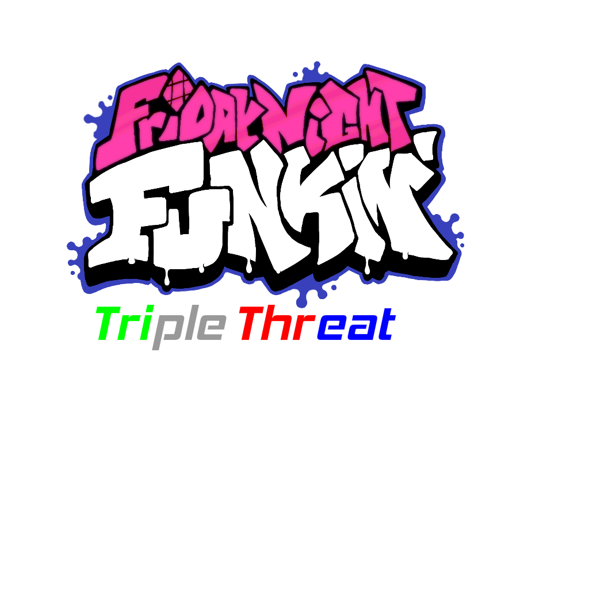

# Friday Night Funkin': Triple Threat
## Friday Night Funkin'
**Friday Night Funkin'** is a rhythm game originally made for Ludum Dare 47 "Stuck In a Loop".

Links: **[itch.io page](https://ninja-muffin24.itch.io/funkin) ⋅ [Newgrounds](https://www.newgrounds.com/portal/view/770371) ⋅ [source code on GitHub](https://github.com/ninjamuffin99/Funkin)**
> Uh oh! Your tryin to kiss ur hot girlfriend, but her MEAN and EVIL dad is trying to KILL you! He's an ex-rockstar, the only way to get to his heart? The power of music... 

## Triple Threat
**Triple Threat** is a mod for Friday Night Funkin' made with Kade Engine.

Links: Not finished yet.

**REMEMBER**: This is a **mod**. This is not the vanilla game and should be treated as a **modification**. This is not and probably will never be official, so don't get confused. Also Credits to the people who made the mods.

## Website ([KadeDev.github.io/kade-engine/](https://KadeDev.github.io/Kade-Engine/))
If you're looking for documentation, changelogs, or guides, you can find those on the Kade Engine website.

#

# Credits
### Friday Night Funkin'
 - [ninjamuffin99](https://twitter.com/ninja_muffin99) - Programming
 - [PhantomArcade3K](https://twitter.com/phantomarcade3k) and [Evilsk8r](https://twitter.com/evilsk8r) - Art
 - [Kawai Sprite](https://twitter.com/kawaisprite) - Music

This game was made with love to Newgrounds and its community. Extra love to Tom Fulp.
### Kade Engine
- [KadeDeveloper](https://twitter.com/KadeDeveloper) - Maintainer and lead programmer
- [The contributors](https://github.com/KadeDev/Kade-Engine/graphs/contributors)

### Shoutouts
- [GWebDev](https://github.com/GrowtopiaFli) - Video Code
- [Rozebud](https://github.com/ThatRozebudDude) - Ideas (that KadeDev stole)
- [Puyo](https://github.com/daniel11420) - Setting up appveyor and a lot of other help

### Creator of the Mod!
- [scott056](https://github.com/scott056) - Made the mod!

### Whitty Mod
(https://gamebanana.com/mods/44214)

### Tricky Mod
(https://gamebanana.com/mods/44334)

### Hex Mod
(https://gamebanana.com/mods/44225)
- ### Cr
